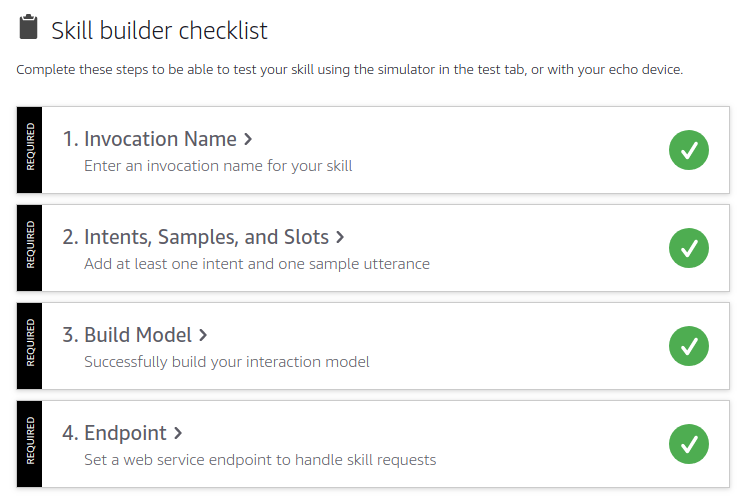

## Introduction

First time I heard about [Alexa / Echo](https://www.amazon.co.uk/Echo) 👀 I loved the idea of having an **assistant** at home capable of playing music on demand, setting up alarms, giving the flash briefings, an so on.    
Currently, I'm working as a **Software Engineer** at [Eurostar](https://www.eurostar.com) (Contractor), and my first project consist of building a **Voice App** using **Amazon Echo - Alexa** and **Google Home** 💻. 
That's quite interesting challenge given the fact I'll be using AWS Lambda function and NodeJS as part of the technology stack.

This post is intended to gather all **my notes** meanwhile I was learning and developing my first Voice App using [Alexa Skills Kit](https://developer.amazon.com/alexa-skills-kit). I thought it will be important to share this notes as I felt quite lost at the beginning.

> Note: I'll be using `JavaScript` and `NodeJS` as a development language and engine for my first Alexa Custom Skill. 

<br>

## Concepts
When I started looking at the documentation 👨‍💻, I realized there is a completely *new vocabulary and concepts*. Let's see some of the concepts I learnt:
- `Alexa Skill`: It is the **basic unit** of Voice App for **Amazon Echo**. So as a **developer** you can **develop and publish** a new Alexa Skill and as a **end user** you can **search and install** that Alexa Skill in your **Amazon Echo**. There are different kind of [skills](https://developer.amazon.com/alexa-skills-kit/learn). 
- `Alexa SKills Kit`: The **Alexa Skills Kit (ASK)** is a collection of **self-service APIs**, **tools**, **documentation**, and **code samples** that makes it fast and easy for you to add skills to Alexa.
- `Alexa Skills Kit Developer Console`: It is the [online tool](https://developer.amazon.com/alexa/console/ask) to **Build**, **Manage**, **Test**, **Launch**, **Measure** and **Delete** your **Alexa Skills**. You have to sign up for an **Amazon Development Account** in order to use it.
- `Skill Id`: Unique identifier for your skill. It is very useful when you need to *connect your AWS Lambda function with your Skill* through a trigger called *Alexa Skill Kit*.
- `Invocation Name`: It's the name used by Alexa to open our app or skill.
- `Intent`: It's a way to group common and **reusable actions or intentions**. An intent represents an action that fulfills a **user's spoken request**. Intents can optionally have arguments called slots. Also is the basic unit of development for a custom Alexa Skill. Each custom Intent have to define the intent schema plus the code to handle that intent. There are some [standard built-in intents](https://developer.amazon.com/docs/custom-skills/standard-built-in-intents.html).
- `Utterances`: A set of likely **spoken phrases** mapped to the **intents**. They are different ways to invoke or activate an intent. For example for **CancelIntent**, we have these utterances: **cancel**, **never mind** and **forget it**.
-  `Slots`: A representative list of possible values for a slot. For example, the intent `I want to travel to {citySlot}` could have different values for **citySlot** like: **Paris**, **Amsterdam**, **Brussels**, and so on.
- `Interaction Model`: It is where you implement the **logic for the skill**, and you also define the **voice interface** through which users interact with the skill. To define the voice interface, you map users' spoken input to the intents your cloud-based service can handle. It includes also **Invocation Name**, **Intents** and **Slot Types**.
- `EndPoint`: It is the place where we configure the **ARN for AWS Lambda** function that will handle the requests for the user interactions or intents. For example, we can define some custom Intents in **Alexa Skills Kit Developer Console** and then implement the logic for that intent in **AWS Lambda** function. Eventually we have to connect both using the **EnpPoint** feature available in **Alexa Skills Kit Developer Console**.
- `ASK SDK`: The [ASK SDK v2 for Node.js](https://github.com/alexa/alexa-skills-kit-sdk-for-nodejs) makes it easier for you to build highly engaging skills. The most useful methods it provides to handle skill responses are: `addRequestHandlers`, `addRequestInterceptors`, `addErrorHandlers` and `lambda`. 
- `AWS SDK`: It is important to notice the *difference* between `ASK SDK` (useful to handle skill requests) and `AWS SDK` (useful to connect our skill with AWS Services). You can see more samples in the [Alexa Skill Building Cookbook](https://github.com/alexa/alexa-cookbook/tree/master/aws).
- `ASK CLI`: Alexa Skills Kit Command Line Interface (ASK CLI) could be installed using [npm](https://www.npmjs.com/package/ask-cli). It exposes some high-level commmands like `init`, `new`, `deploy`, `clone`, `validate`, and `simulate` that we can use in the command line. [ASK CLI Command Reference](https://developer.amazon.com/docs/smapi/ask-cli-command-reference.html).
- `AWS CLI`: [Amazon Web Services Command Line Interface](https://docs.aws.amazon.com/cli/latest/reference/) could be useful in some Alexa advanced projects that requires other AWS Services to be created.
  
<br>


## Requirements
Once we are more familiar with the main concepts. Before starting to develop a custom skill, there are some requirements: 
* Register for an [Amazon Developer Account](https://developer.amazon.com?&sc_category=Owned&sc_channel=RD&sc_campaign=Evangelism2018&sc_publisher=github&sc_content=Content&sc_detail=city-guide-nodejs-V2_CLI-1&sc_funnel=Convert&sc_country=WW&sc_medium=Owned_RD_Evangelism2018_github_Content_city-guide-nodejs-V2_CLI-1_Convert_WW_beginnersdevs&sc_segment=beginnersdevs)
* Register for an [AWS Account](https://aws.amazon.com/)
  > Note you can request for [promotional credits on AWS for Alexa](https://developer.amazon.com/alexa-skills-kit/alexa-aws-credits)
* As we will be using NodeJS:
  * NodeJS
  * NPM
  * Install and Setup [AWS CLI](https://docs.aws.amazon.com/cli/latest/userguide/installing.html)
  * Install and Setup [ASK CLI](https://developer.amazon.com/docs/smapi/quick-start-alexa-skills-kit-command-line-interface.html?&sc_category=Owned&sc_channel=RD&sc_campaign=Evangelism2018&sc_publisher=github&sc_content=Content&sc_detail=city-guide-nodejs-V2_CLI-1&sc_funnel=Convert&sc_country=WW&sc_medium=Owned_RD_Evangelism2018_github_Content_city-guide-nodejs-V2_CLI-1_Convert_WW_beginnersdevs&sc_segment=beginnersdevs)


<br>

## Project Structure
Once you have installed all the requirements on your laptop, let's see what is the project structure or skeleton required for Alexa Skill. The project structure for Alexa Custom Skill is:

```js
skill.json   // skill manifest to define metadata

.ask
  |- config  // config file for ask cli

lambda
  |- custom
        |- node_modules // must be uploaded to AWS Lambda function 
        |- index.js     // lambda function to define intent handlers
        |- package.json // npm dependencies

models            // Define Interaction Model for each language. 
  |- en-US.json     
  |- en-GB.json
```
> [Skill Manifest Schema](https://developer.amazon.com/docs/smapi/skill-manifest.html)
>
> [Interaction Model Schema](https://developer.amazon.com/docs/smapi/interaction-model-schema.html)


As a beginner in the **Voice Apps** world, it is important to *note* that this is the structure used to define our **Skill metadata**, our **Interaction Model schema** and our **Handlers code**. **It is important to keep that structure like that** because `ask-cli` will be using it in order to deploy to Alexa Skills Kit Developer Console and AWS Lambda. Further explanation about the files:
- `skill.json`: where skill metadata lives. For example, skill_id or Lambda function ARN. 
- `.ask/config`: ask-cli will be required to automate the creation, publication and update for our interaction model or lambda function. This config file is where our ask cli config lives. **Note** that [authentication config for lambda function could be handled separately](https://developer.amazon.com/docs/smapi/set-up-credentials-for-an-amazon-web-services-account.html). 
- `lambda/custom/*`: where our intents handlers code lives. In order to test it we should deploy using ask-cli. We'll see how later in the post. Here is where we'll use `ask sdk` to develop handlers for our intents.
- `models/*`: where our interaction model json definition lives. Whatever we define here as JSON format, we should implement the handlers in the lambda function code.

<br>


## Starting templates / Code Samples
There are some 🚀 **official boilerplates / code samples** 🚀 to start with. All of them are `github` projects, so you can clone and start playing with them. I recommend to go through **one of them** and get it **deployed** and tested via your test environment provided by **Alexa Skills Kit Developer Console**: 
- [Amazon Official Code Samples](https://github.com/alexa/alexa-skills-kit-sdk-for-nodejs#samples)


> **IMPORTANT**: Recently (April 2018), it was publish the V2 for Alexa Skill Kit SDK. So, make sure that the code you are using in your sample is pointing to V2 and not V1. 
> 
> ❌ V1 uses `require("alexa-sdk)`
>
> ✅ V2 uses `require("ask-sdk-core")`

<br>

## Problems
As part of my **up and running** for my first Alexa Skill, I found some **issues** in the process, I documented some solutions:

❗️ Problem 1 ❗️ 

*A valid interaction model is required to test your skill there was an internal server error*

> Solution: Check in **Alexa Skills Kit Developer Console** your Skill builder checklist. Everyone of these 4 items should be chech in green!
> 


❗️ Problem 2 ❗️ 

*Error parsing the requested content. Please validate the enums in the request, which is a common cause for this exception*
> Solution: https://forums.developer.amazon.com/questions/165659/error-parsing-the-requested-content-please-validat.html

<br>

## Other Resources
- [Alexa SDK for NodeJS (V1)](https://github.com/alexa/alexa-skills-kit-sdk-for-nodejs), [ASK SDK V1 npm](https://www.npmjs.com/package/alexa-sdk)
- [Alexa SDK for NodeJS (V2)](https://github.com/alexa/alexa-skills-kit-sdk-for-nodejs/blob/2.0.x/Readme.md), [ASK SDK V2 npm](https://www.npmjs.com/package/ask-sdk)
- [Alexa Cookbook](https://github.com/alexa/alexa-cookbook/tree/master/aws)
    
    
I hope these notes will help on clarify little bit the new concepts on Voice Apps. 
Stay tunned as I'll be publishing more post about advanced scenarios and deployments for Alexa Custom Skills!
